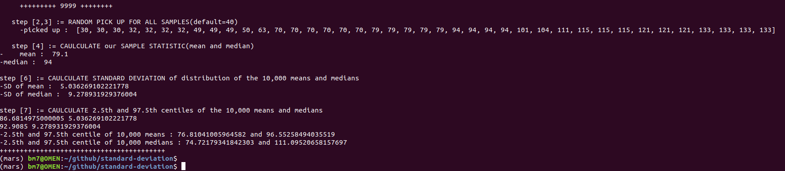
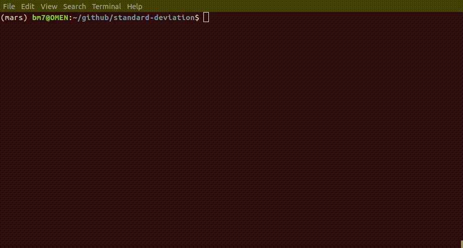

### bootstrap-method-for-error-estimation
#### Language used: Python 3 on Ubuntu 18.04 and Core i7-9750 (CPU @2.60GHz x 12)

#### Type of data
The main dataset is made up by IQ. list of 40 sample and each between 30 and 170.

#### Result of computing

